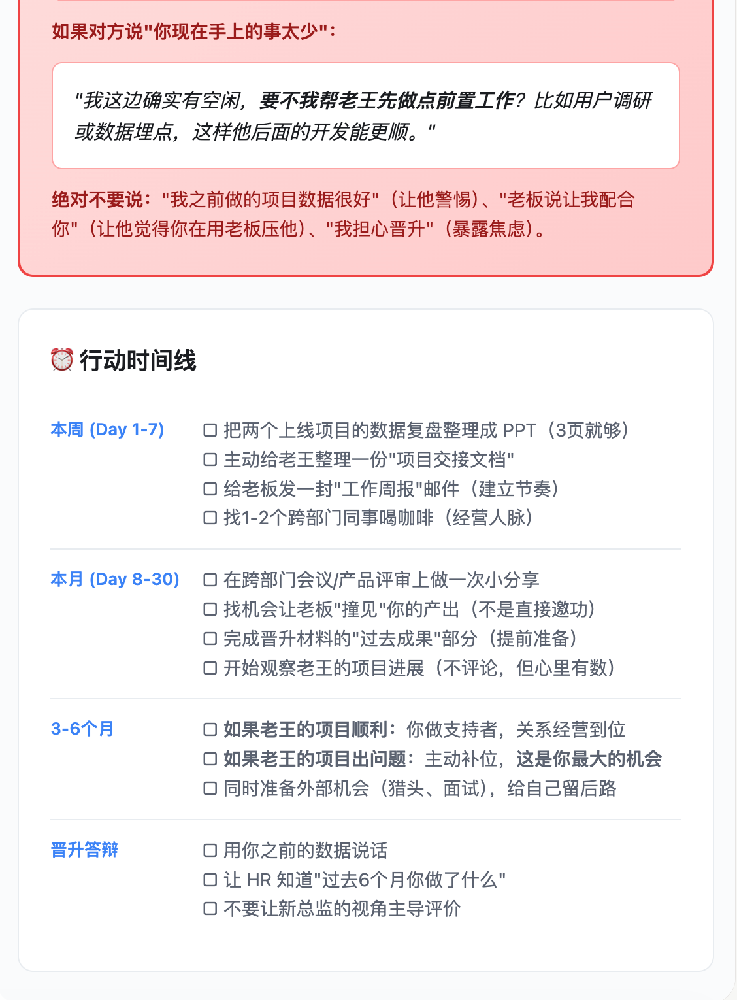
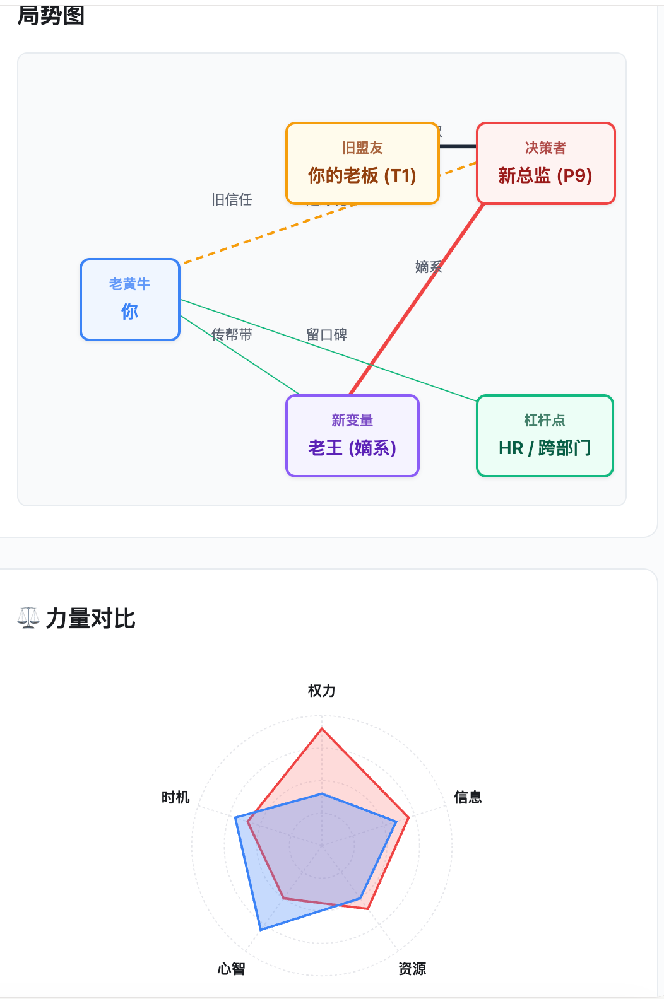
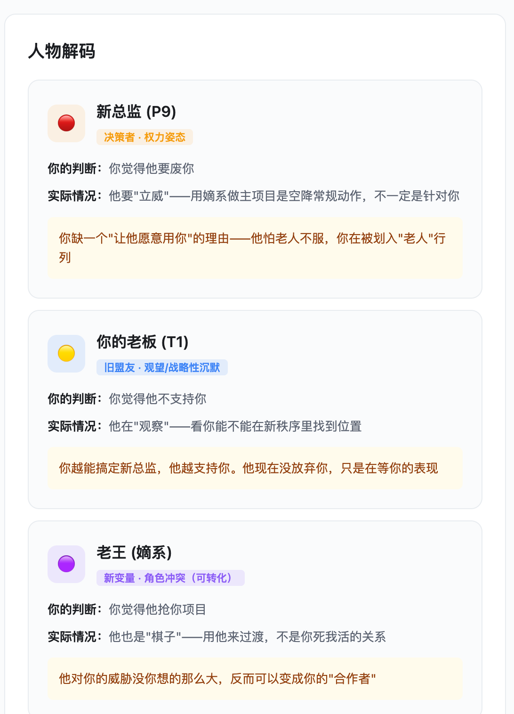

# 职场关系地图（Workplace Relationship Map）

> 老板不挺你、同事抢功、跨部门推不动、想跳槽又不知道去哪？把情况说给我听，5 分钟给你一份明天就能照着做的方案——看清局、找对人、出口语话术。

## 这是什么

一个 AI 技能（Skill），专治职场关系困局。不是鸡汤，不是"沟通技巧"清单——是根据你真实处境，给你**具体话术 + 可执行策略 + 可视化关系图**。

## 覆盖场景（10 大经典困局）

1. 老板不支持 / 不信任
2. 老黄牛（活多没功，被系统性边缘化）
3. 新领导空降（权力重构期）
4. 跨部门踢皮球
5. 35 岁转型迷茫
6. 同事抢功 / 甩锅
7. 被架空 / 实权稀释
8. 站队困境
9. 边缘人（被排除在核心圈外）
10. 向上管理失败

## 核心能力

- **启动协议**：先给你填空模板 + 问 2-4 个澄清问题，确保我没理解错再说方案
- **火眼金睛**：识别 8 类关系阻力信号，从话术到权力结构拆到底
- **力量对比图**：可视化你和关键人的权力/关系对比
- **悟空策略库**：10 种源自《黑神话：悟空》的破局策略，每一条都有具体话术
- **急救话术**：明天上班就能用的话术模板
- **交互式 HTML 报告**：可保存、可分享的分析报告

## 效果预览

以"老黄牛困境"为例——你被新总监系统性边缘化，旧老板观望：

### 急救话术



### 局势图 + 力量对比



### 人物解码



## 安装使用

### 虾评 / Coze

在虾评或 Coze 平台搜索"职场关系地图"一键安装。

### OpenClaw

```bash
claw skill install workplace-relationship-map
```

或手动：将本仓库 clone 到 OpenClaw 的 `skills/` 目录下。

### WorkBuddy

```bash
workbuddy skill install workplace-relationship-map
```

或手动：将本仓库 clone 到 WorkBuddy 的 `skills/` 目录下。

### 其他支持 Skill 协议的 Agent 框架

将本仓库放入对应框架的 skills 目录，确保 `SKILL.md` 可被 Agent 读取即可。

## 开源与来源策略

- **提示词内容**（SKILL.md、references/、templates/ 下的文案与策略）采用 [CC BY 4.0](https://creativecommons.org/licenses/by/4.0/) 许可
- **脚本与工具代码**（如有）单独采用 [MIT](https://opensource.org/licenses/MIT) 许可
- **第三方或转载内容**：不直接并入主提示词库。先放入 `references/` 或标记为 `third-party-review`，确认授权后再发布

## 文件结构

```
├── SKILL.md                          # 技能主文件（含启动协议 + 场景 + 策略）
├── assets/                           # 效果演示图
│   ├── demo-talk.png                 # 急救话术示例
│   ├── demo-map.png                  # 局势图 + 力量对比示例
│   └── demo-decode.png               # 人物解码示例
├── cases/                            # 测试案例
│   ├── 2026-06-05-老黄牛困境.md       # 老黄牛案例全记录
│   └── case-laohuangniu-demo.html     # 老黄牛案例 HTML 报告
├── references/                       # 参考知识库
│   ├── conversation-scaffold.md       # 启动协议：输入模板 + 澄清问题库
│   ├── problem-archetypes.md          # 10 大场景定义
│   ├── signal-patterns.md             # 8 类阻力信号
│   ├── strategy-playbook.md           # 基础策略库
│   └── wukong-strategies.md           # 10 种悟空策略
└── templates/                         # HTML 报告模板
    ├── relationship-map.html          # v1 模板
    └── relationship-map-v2.html       # v2 模板
```

## 版本

- **v2.3（当前）**：启动协议版 —— 先问清再出方案
- v2.2：10 大场景 + 悟空策略库 + 5 大功能
- v1：基础 6 场景 + 6 策略

## 作者

虾评 @绿玩-wadang | GitHub @rockdna

---

*"职场如江湖，有人靠山吃山，有人凭本事吃饭——你得先看清谁是谁。"*
